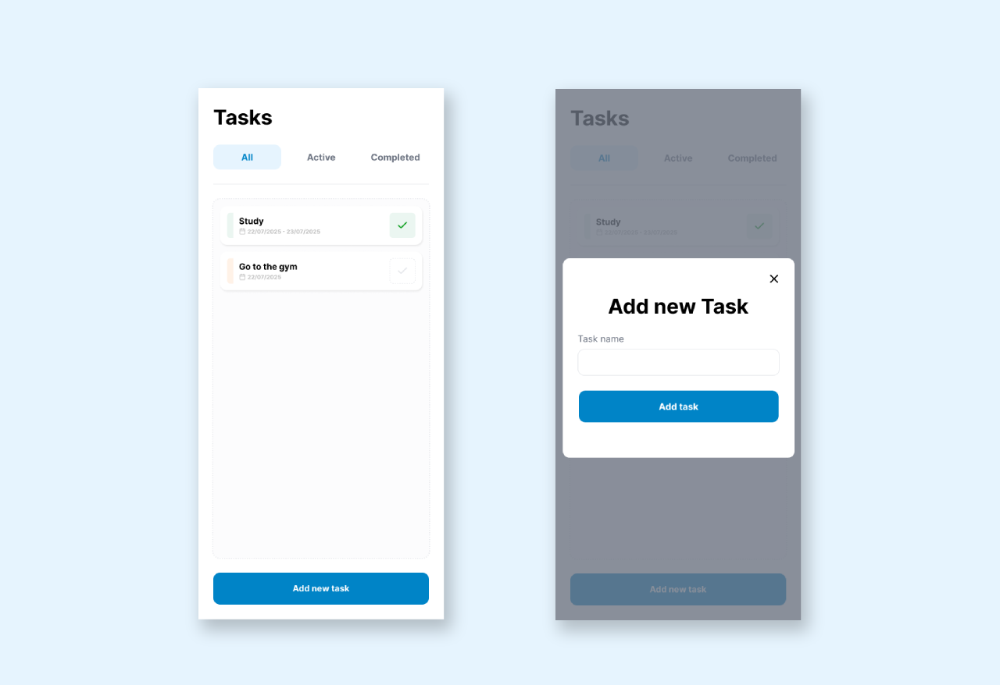
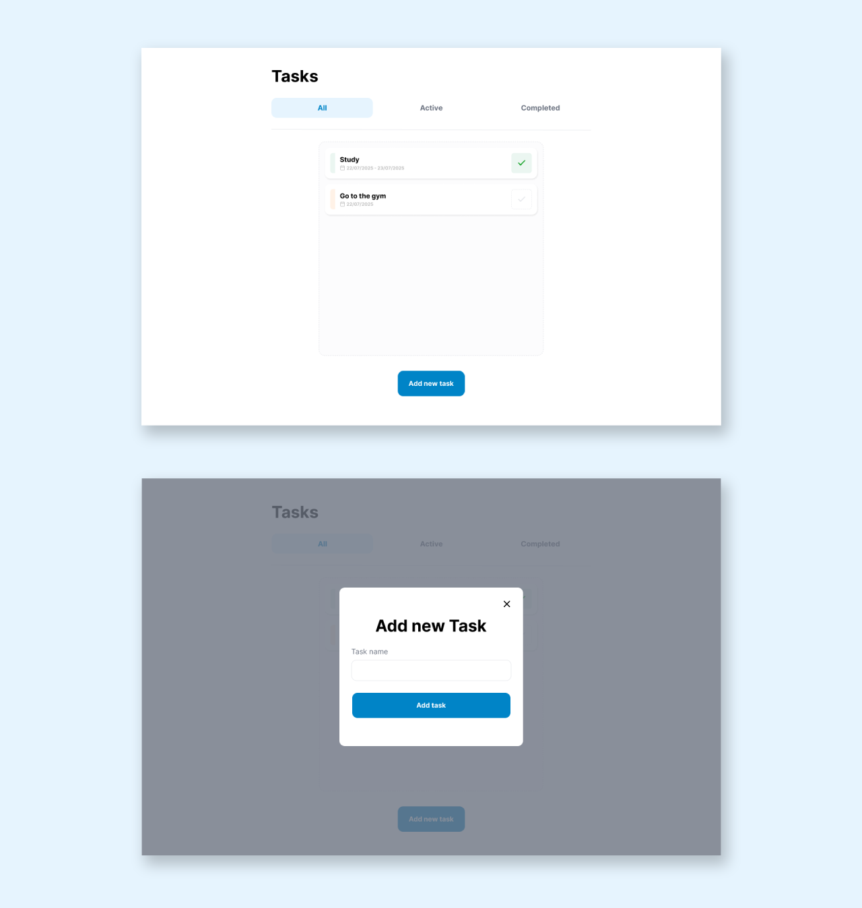

# Task List

## About the Project

**Task List** is a modern and responsive to-do list application built with React and TypeScript. It allows users to manage their daily tasks efficiently with an intuitive and accessible interface.

The application provides core features such as:

- Adding, completing, and filtering tasks by status (All, Active, Completed)
- Drag-and-drop reordering of tasks for better organization
- Real-time updates using local state management with React hooks
- A clean and mobile-first UI built with Tailwind CSS
- Accessibility enhancements with ARIA attributes and keyboard support

## ✨ Figma Design

The entire app layout was designed using **Figma**.  
You can view the design here:  
👉 [Figma Project Link](https://www.figma.com/design/ffcS9ZL5vOtn8o3vxCDTbZ/Untitled?node-id=992-2&t=ZwuxkFwMaNyjDNDF-1)

### Mobile View



### Desktop View



## Features

- **Compound Component Pattern** with shared state via React Context.
- **Local State Management** using `useState`.
- **Performance Optimization** with `useCallback` and `useMemo`.
- **Drag-and-Drop** functionality for reordering tasks.
- **Task Filtering** (All, Active, Completed).
- **Accessibility** (ARIA roles, keyboard navigation).
- **Responsive Layout** using Tailwind CSS (Mobile First).
- **Unit Testing** using React Testing Library and Jest.

## Technologies Used

- **React 19**
- **React Router DOM 7**
- **TypeScript**
- **Vite**
- **Tailwind CSS**
- **Jest**
- **React Testing Library**
- **React Feather Icons**
- **ESLint & TypeScript ESLint**

## Installation:

To run the project locally, follow the steps below:

### 1. Prerequisites

Before running this project locally, make sure you have the following installed:

- **Node.js** (v18 or later) — [Download here](https://nodejs.org/)
- **npm** (comes with Node.js) or **yarn**
- A modern code editor like [Visual Studio Code](https://code.visualstudio.com/)

You can verify your versions by running:

```bash
node -v
npm -v
```


### 2. Clone the repository

```bash
git clone https://github.com/leandrofc/task-list.git
```

### 3. Access the project directory:

```sh
cd task-list
```

### 4. Install dependencies

```bash
npm install
```

### 5. Start the development server

```bash
npm run dev
```

## Running Tests:

To run the unit tests:
```bash
npm run test
```